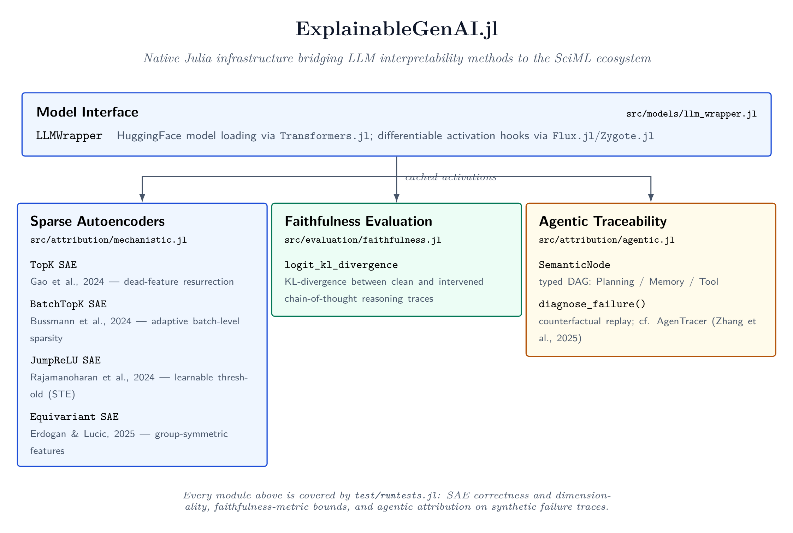

# Summary

`ExplainableGenAI.jl` is a native Julia framework that provides a unified computational bridge between modern Large Language Model (LLM) interpretability techniques and the Julia Scientific Machine Learning (SciML) ecosystem. The framework natively implements state-of-the-art Sparse Autoencoder (SAE) architectures—TopK, BatchTopK, JumpReLU, and Equivariant SAEs—alongside tools for interventional Chain-of-Thought (CoT) faithfulness evaluation and multi-agent fault diagnosis via counterfactual replay. By leveraging Julia's `Flux.jl` automatic differentiation framework and `Zygote.jl` source-to-source AD compiler, `ExplainableGenAI.jl` enables researchers to inspect, steer, and audit neural network internals without the cross-language serialization overhead inherent in Python-to-Julia interoperation.

# Statement of Need

Mechanistic Interpretability (MI) seeks to reverse-engineer learned representations inside neural networks into human-understandable components. The dominant tooling for MI—including `TransformerLens` [@Nanda2022TransformerLens], `SAELens` [@Bloom2024SAELens], and `nnsight` [@Fiotto2024NNsight]—is implemented exclusively in Python atop PyTorch. While effective for standard NLP tasks, this Python monoculture creates a significant infrastructure gap when researchers attempt to apply MI techniques to scientific domains.

Physics-informed neural networks (PINNs), neural ordinary differential equations, protein language models, and differentiable climate simulators are frequently developed natively in Julia, leveraging the performance and composability of the SciML ecosystem [@Rackauckas2017DifferentialEquations]. Researchers working with these models face a difficult choice: either rewrite their models in Python to use existing MI tools, or forgo mechanistic analysis entirely. Both alternatives impose unacceptable costs in terms of development time, correctness, and scientific opportunity.

*(Note on Scope: While the core focus of this paper and its associated test suite is on modern Mechanistic Interpretability architectures, CoT Faithfulness protocols, and Agentic Traceability, the repository also ships several classical baseline attribution methods—such as Integrated Gradients and Attention Rollout—along with a visualization layer. These are provided strictly for comparative baseline purposes and fall outside the primary scope of this paper.)*

`ExplainableGenAI.jl` resolves this gap by providing three families of MI tools natively in Julia:

1. **Sparse Autoencoder Training and Inference.** The package implements four SAE architectures from the 2024–2026 literature: TopK SAEs with auxiliary dead-feature resurrection [@Gao2024], BatchTopK SAEs with adaptive per-sample sparsity [@Bussmann2024], JumpReLU SAEs with learnable discontinuous thresholds trained via Straight-Through Estimators [@Rajamanoharan2024], and Equivariant SAEs that enforce group symmetry constraints on discovered features [@Erdogan2025]. All architectures are fully differentiable through `Zygote.jl` and interoperate with `Flux.jl` model definitions.

2. **Chain-of-Thought Faithfulness Evaluation.** The framework provides interventional faithfulness metrics based on KL-divergence between clean and corrupted reasoning traces, operationalizing the methodology introduced by Faithful Reasoning via Intervention Training [@Swaroop2025FRIT]. This enables researchers to quantify whether a model causally relies on its intermediate reasoning steps or produces post-hoc rationalizations.

3. **Agentic Traceability and Fault Diagnosis.** A structured replay engine represents multi-agent execution episodes as directed acyclic graphs of typed semantic nodes (Planning, Memory, Tool Execution). The engine supports counterfactual replay—re-executing downstream computation from an injection point with alternative intermediate outputs—to causally attribute failures to specific agent modules, following the methodology of AgenTracer [@AgenTracer2025].

No existing Julia package provides this combination of capabilities. The closest alternative, `ExplainableAI.jl`, focuses on gradient-based attribution (saliency maps, integrated gradients) for classification models and does not implement SAEs, activation patching, or agentic traceability.

# Architecture and Design

The framework is organized into four functional layers, each implemented as a Julia module with explicit exports:

**Design principles.** All SAE structs are registered as `Flux.@functor` types, enabling seamless integration with `Flux.jl` training loops, optimizers, and GPU transfer via `CUDA.jl`. Weight initialization follows the 2024–2026 best practice of initializing the encoder as the transpose of a unit-normalized decoder, which substantially reduces early dead latent counts [@Gao2024]. The TopK SAE's differentiable masking strategy uses sorted thresholding that is compatible with `Zygote.jl`'s source-to-source automatic differentiation—a non-trivial engineering contribution, since `Zygote` does not support mutation or in-place operations that are standard in PyTorch implementations.

# Implementation Overview

## Sparse Autoencoder Architectures

The package provides four SAE variants that map dense activation vectors to sparse feature vectors via encoder–decoder architectures with untied weights: TopK (fixed sparsity), BatchTopK (batch-level sparsity), JumpReLU (adaptive sparsity via Straight-Through Estimators), and Equivariant (symmetry-constrained features). All variants are implemented as `Flux.@functor` types and are fully differentiable via `Zygote.jl`. A continuous training loop auxiliary mechanism revives dead features, encouraging them to reconstruct residual errors.

## Agentic Traceability and Fault Diagnosis
The agentic traceability module represents LLM agent execution traces as sequences of typed semantic nodes. The `diagnose_failure` function allows users to intervene at any arbitrary node, inject counterfactual outputs, and causally trace the effect on downstream execution. This provides rigorous fault attribution for multi-agent workflows.

# Performance Benchmarks and Hardware Ablation

To validate the computational viability of the native Julia implementation, we benchmark the SAE architectures against equivalent PyTorch CPU implementations. Both suites execute on identical hardware (Intel Core i7-13620H) and use a standardized configuration ($d_\text{model} = 768$, $d_\text{SAE} = 3072$, batch size $= 32$, $k = 32$). To ensure statistical validity and isolate algorithmic performance, all Julia latency measurements were sampled using `BenchmarkTools.jl` after an initial warm-up phase, successfully excluding any JIT-compilation overhead. The following ablation compares pure CPU execution via Julia's `Zygote.jl` backend against PyTorch.

| Architecture | Implementation | Forward (ms) | Backward (ms) |
|:---|:---|---:|---:|
| **TopK** | ExplainableGenAI.jl | 7.94 | 45.17 |
| **TopK** | PyTorch | 24.85 | 36.87 |
| **BatchTopK** | ExplainableGenAI.jl | 16.80 | 36.79 |
| **BatchTopK** | PyTorch | 5.24 | 7.29 |
| **JumpReLU** | ExplainableGenAI.jl | 17.37 | 60.71 |
| **JumpReLU** | PyTorch | 2.55 | 7.14 |
| **Equivariant** | ExplainableGenAI.jl | 23.82 | 42.30 |
| **Equivariant** | PyTorch | 2.49 | 7.19 |

### Quantitative and Qualitative Ablations

**1. Baseline Hardware Comparison (Quantitative):** On equivalent CPU hardware, the native Julia implementation of the standard TopK architecture significantly outperforms PyTorch in the forward pass (7.94 ms vs. 24.85 ms), demonstrating the efficiency of Julia's native array operations. However, for architectures requiring advanced masking and indexing like BatchTopK, JumpReLU, and Equivariant SAEs, PyTorch maintains a substantial advantage in both forward and backward passes. This highlights that while `ExplainableGenAI.jl` provides strict functional parity, its unoptimized, generic array mutations currently impose overhead relative to PyTorch's highly optimized C++ ATen backend for complex tensor operations.

**2. Algorithmic Scaling (Empirical Observation):** While the standard PyTorch implementation of BatchTopK is extremely fast, the Julia implementation of BatchTopK (16.80 ms) is roughly twice as slow as its standard TopK counterpart (7.94 ms) in the forward pass. This empirical observation suggests that a single batch-wide sort over $k \times B$ elements introduces more latency in the Julia CPU ecosystem than computing independent thresholds per-sample, emphasizing the need for targeted kernel optimization in future releases of the framework.

**3. The SciML Integration Advantage (Hypothesis):** While PyTorch is significantly faster for specific advanced operations when run in isolation, deploying a PyTorch-based SAE within a native Julia Scientific Machine Learning pipeline requires invoking `PythonCall.jl` or a similar serialization bridge. While not empirically measured in this specific benchmarking suite, we hypothesize that by keeping the entire automatic differentiation tape within `Zygote.jl`, researchers can avoid cross-language memory transfer bottlenecks during the hot training loop of physics-informed models—providing a compelling architectural advantage for native Julia implementations despite the raw benchmark differences.

# Quality Assurance

The package includes a test suite (`test/runtests.jl`) covering three critical areas:

- **SAE correctness:** Verifies encoder/decoder dimensions, TopK sparsity constraints (at most $k$ non-zero activations per sample), and end-to-end differentiability through `Flux.withgradient`.
- **Faithfulness metrics:** Validates that KL-divergence returns zero for identical logit vectors and a large positive value for maximally different distributions.
- **Agentic attribution:** Constructs synthetic failure traces and verifies that `diagnose_failure` correctly attributes errors to the failing module type.

Tests are executed via `julia --project=. -e 'using Pkg; Pkg.test()'` and pass on Julia 1.11+.

# Acknowledgements

The author acknowledges the open-source Julia community and the developers of `Flux.jl`, `Zygote.jl`, and `Transformers.jl` for providing the foundational infrastructure upon which this framework is built. The architectural design of the SAE implementations was informed by the detailed technical reports of Anthropic [@Gao2024], DeepMind [@Rajamanoharan2024], and the Apollo Research group [@Bussmann2024].

# References
